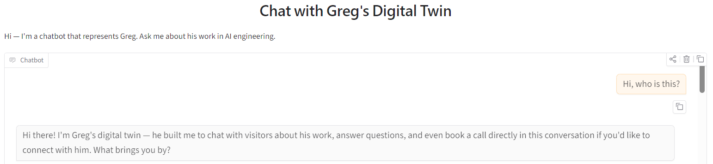

# Greg's Digital Twin

> Live demo available on Hugging Face Spaces:  [Digital Twin](https://huggingface.co/spaces/gibsongHF/Greg_Digital_Twin)

An AI-powered chatbot that answers questions about my professional background using my own documents and project history,
schedules 15-minute intro calls onto my Cal.com calendar via Claude tool use, and holds spoken conversations —
talk to it with your microphone and it answers back in a natural voice.

Built as a practical application of Retrieval-Augmented Generation (RAG), this project turns static career materials into a searchable, conversational system.

It’s essentially a structured, queryable version of a resume — with context, a calendar, and a voice.

## What it can do

- Answer questions about my work history and roles
- Explain projects and technical decisions
- Summarize skills and tools across different domains
- Retrieve relevant context from source documents
- Generate clear, conversational responses based on that context
- Schedule a 15-minute intro call — the bot checks my real Cal.com availability, offers open slots, and books the meeting for you
- Respond to voice: record a question with the mic and hear the reply read aloud (speech-to-text and text-to-speech via Deepgram)

## Why I built it

I wanted to move beyond static portfolios and build something interactive that demonstrates how AI systems actually work.

This project reflects how I think about AI engineering:
- structured inputs
- controlled retrieval
- explainable outputs
- real-world usefulness over novelty

## How the chatbot works

1. Personal documents are chunked and embedded
2. Embeddings are stored in a vector database
3. User queries are converted into embeddings
4. Relevant chunks are retrieved
5. An LLM generates a response using that context

## How the booking flow works

1. Visitor expresses interest in talking → bot decides to invoke tools.
2. Bot calls `list_available_slots(timezone)` → Cal.com API returns open 15-min slots.
3. Bot shows 3-5 options in chat, asks visitor to pick one + confirms name/email.
4. Bot calls `create_booking(start_iso, name, email, timezone, topic)`.
5. Cal.com sends the visitor a calendar invite + the meeting link, and emails Greg.

## How the voice flow works

1. Visitor records a message with the microphone → Deepgram Nova transcribes it and it appears in the chat as their message.
2. The transcript goes through the same RAG + Claude pipeline as typed messages (including booking tools), streaming the reply into the chat.
3. While the reply is still streaming, completed sentences are already being synthesized in parallel with Deepgram Aura (Orpheus voice) — markdown formatting is stripped so it isn't read aloud.
4. The stitched reply audio autoplays as soon as the text finishes. Typed messages get a text-only reply; voice in, voice out.

## Stack
- **Chat:** Anthropic Claude Sonnet 4.6 (`claude-sonnet-4-6`) with tool use
- **Voice:** Deepgram Nova-3 (speech-to-text) + Aura-2 Orpheus (text-to-speech)
- **Embeddings:** OpenAI `text-embedding-3-small`
- **Vector store:** ChromaDB (local, persisted to `chroma_db/`)
- **UI:** Gradio Blocks (Gradio 6.x — messages format) with mic input and autoplayed reply audio
- **Booking:** Cal.com v2 API
- **Notifications:** Pushover
- **Deploy:** Docker → Hugging Face Spaces

## Project layout
```
app.py                  # Gradio entrypoint (chat UI + mic input + reply audio)
twin/
  prompts.py            # System prompt
  rag.py                # Paragraph chunking + Chroma + embeddings
  tools.py              # Claude tool schemas + dispatch
  calcom.py             # Cal.com API client (v2)
  llm.py                # Claude client + tool-call loop
  voice.py              # Deepgram STT + streaming parallel TTS
  convolog.py           # Conversation logger (JSONL)
knowledge_base/
  about_greg.md         # Knowledge base — drop more .md files here
  resume.md
logs/
  conversations.jsonl   # One JSON object per turn (gitignored)
Dockerfile
requirements.txt
.env
```

## Links
- Hugging Face Space: [Live demo](https://huggingface.co/spaces/gibsongHF/Greg_Digital_Twin)
- Portfolio: [Website](https://gibson-ai.com)


Original project via SuperDataScience, expansions including calendar booking credit JeanWeng01